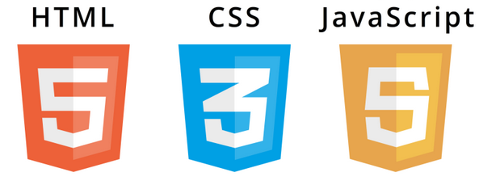

# Week 1

Hello! Welcome to COMP6080 - Web frontend programming! :)

### Today...

🧊 Intros and Icebreakers

🏡 Admin + Housekeeping

🚀 Introduction to Frontend Programming

🛠️ HTML + CSS

## Introductions

```
Name: Oliver Xu
Degree + year: 4th year Aerospace Engineering/Computer Science
Hobbies: Music (especially classical!), Planes, Motorbikes
```

Now your turn...

## Course Info

**Course Website**: https://cgi.cse.unsw.edu.au/~cs6080/23T3. For all course content and info including lectures, tutorials, assignments etc.

**GitLab**: Where you can find tutorial exercises and where you will be completing your assignment work.

### Where to get help?

- **Help Sessions**: https://cgi.cse.unsw.edu.au/~cs6080/23T3/timetable/help-sessions
- **Ed Forum**: https://edstem.org/au/courses/13869/discussion/.
- **Me**: z5310488@ad.unsw.edu.au
- **Course Email**: cs6080@cse.unsw.edu.au

## Introduction to Frontend Programming



3 building blocks of frontend development:

1. **HTML** (HyperText Markup Language): defines the content and structure of a webpage.
2. **CSS** (Cascading Style Sheets): used to add style to your HTML documents.
3. **JavaScript**: makes your webpage dynamic.

A web browser is a tool that processes HTML, CSS, JS (and more) and renders it for us to see.

## HTML Basics

## CSS Basics

## Exercise
