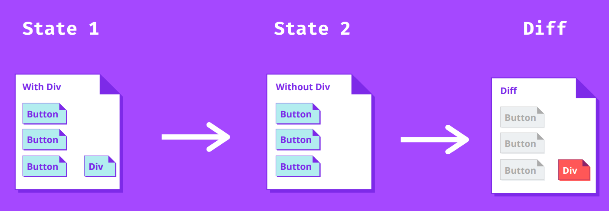

# Week 8

Hello! Welcome to week 8!

### 📢 Updates & Reminders

- Assignment 3 marks out end of this week!
- Assignment 4 (React: Presto!) due Friday (Week 10) 19th April, 10pm

### Today...

🛠️ React Internals

🏹 Hooks: useState

🌐 React Router

## React Internals: Virtual DOM

> The "virtual DOM" is React's representation of the DOM.

- Updating the DOM can be computationally expensive, when we make a change the DOM often needs to be recalculated.

- Solution: keep a "copy" of the DOM in memory and make changes to that one. Sync up the actual DOM with the virtual DOM and only update the difference.



## Hooks: useState

- Hooks are built-in React functions that provide many useful features.

> The `useState` hook allows React to track the state of variables and re-render components based on state changes.

```js
const [state, setState] = useState(initialValue);

// e.g.
const [threads, setThreads] = useState([]);

// later...
setThreads([{ id: 1, text: 'text' }]);
// threads = [{ id: 1, text: 'text' }], re-render.
```

Demo `1.useState`

## React Router

> `react-router` is a popular library used with React that enables you to navigate to different pages within your application.

See `exercises/react-router-example`.
